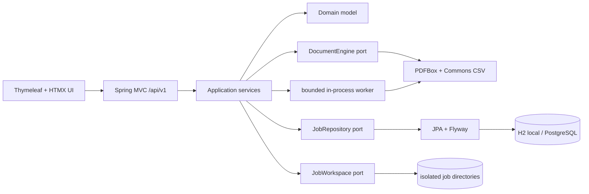
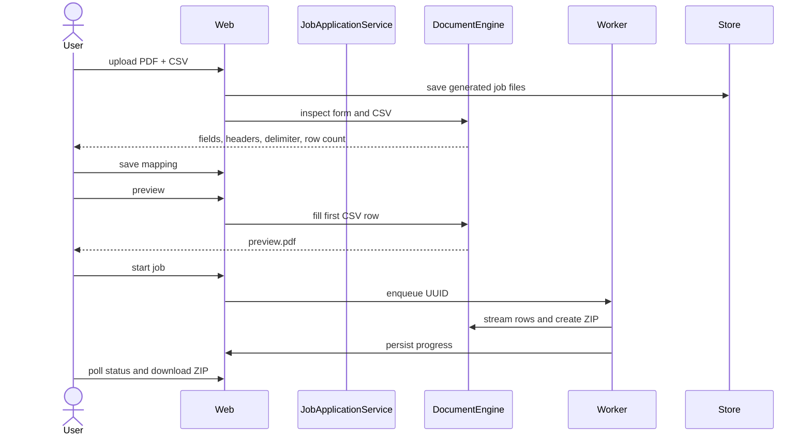

# Architecture

PDF Batch Community is a Java 21 modular monolith. Its module boundaries keep
document processing and use cases independent of Spring Boot so a separate
worker can be introduced later without rewriting the domain.



## Module responsibilities

### `pdf-batch-core`

Owns `BatchJob`, explicit state transitions, validation, application use cases,
worker orchestration, and ports. It has no framework dependencies.

### `pdf-batch-document`

Inspects and fills AcroForm text fields, validates and streams CSV records,
generates safe collision-free filenames, writes ZIP entries, and implements the
isolated local workspace.

### `pdf-batch-persistence`

Maps the domain aggregate to normalized JPA tables. Flyway is the only schema
creation mechanism. The adapter shields the core from JPA.

### `pdf-batch-app`

Wires adapters, exposes REST/OpenAPI and the server-rendered UI, applies HTTP
security headers and request limits, runs retention cleanup, and owns the
single-thread bounded dispatcher.

## Workflow



## State model

The implemented main path is:

```text
DRAFT -> READY -> QUEUED -> PROCESSING -> PACKAGING
      -> COMPLETED | COMPLETED_WITH_ERRORS
```

Active jobs can move through `CANCELLING` to `CANCELLED`. Unexpected processing
errors move non-terminal jobs to `FAILED`; retention removes non-active expired
jobs and their files. Transitions and monotonic counters are tested in core.

## Local and PostgreSQL profiles

The default `local` profile uses an H2 file database in PostgreSQL compatibility
mode for a zero-setup test loop. `postgres` uses PostgreSQL 17 through Docker
Compose. Both use the same Flyway migration and Hibernate schema validation.
H2 is deliberately not presented as the future hosted deployment database.

## Scaling seam

`JobDispatchPort`, `JobRepository`, `DocumentEngine`, and `JobWorkspace` are
explicit ports. A later worker process can consume job IDs and reuse the domain
and document adapter. No message broker or distributed worker is part of this
release.
