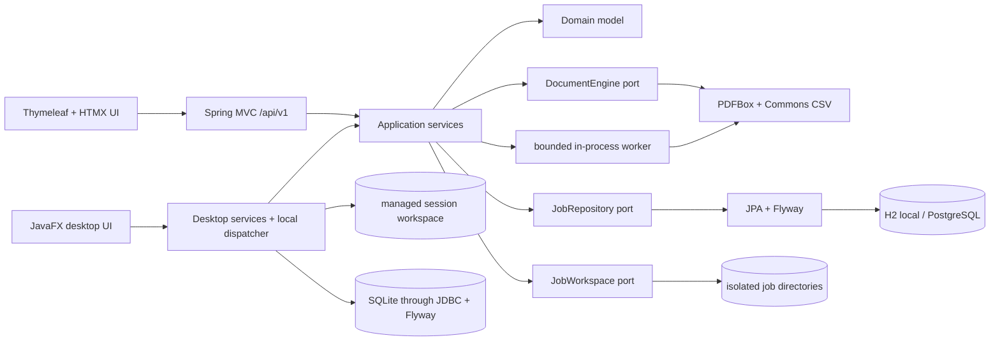
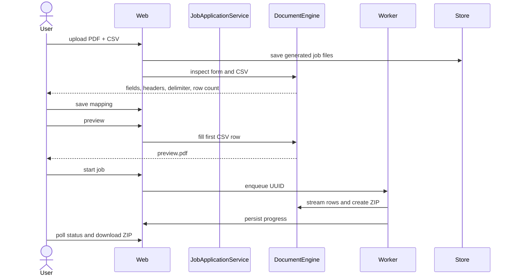

# Architecture

PDF Batch Studio is a Java 21 modular monolith with two delivery adapters: a
Spring Boot web application and an offline JavaFX desktop application. Its
module boundaries keep document processing and use cases independent of both UI
frameworks so a separate worker can be introduced later without rewriting the
domain.



## Module responsibilities

### `pdf-batch-core`

Owns `BatchJob`, explicit state transitions, validation, application use cases,
worker orchestration, and ports. It has no framework dependencies.

### `pdf-batch-document`

Inspects and fills AcroForms, validates and streams CSV records,
generates safe collision-free filenames, writes ZIP entries, and implements the
isolated local workspace.

### `pdf-batch-persistence`

Maps the domain aggregate to normalized JPA tables. Flyway is the only schema
creation mechanism. The adapter shields the core from JPA.

### `pdf-batch-server`

Wires adapters, exposes REST/OpenAPI and the server-rendered UI, applies HTTP
security headers and request limits, runs retention cleanup, and owns the
configurable bounded worker pool and queue.

### `pdf-batch-desktop`

Uses a conventional Controller → Service → Repository structure within the
existing module. MainController owns interaction and localization, the
ViewModel and workflow service own the active batch, StudioRepository owns
SQLite access and Flyway migrations. TableImportService normalizes XLSX to the
existing bounded CSV pipeline. ProjectArchive handles the versioned exchange
format. DemoService generates the bundled examples locally.

SQLite tables are templates, projects, field_mappings, batch_runs, batch_errors
and app_settings. PDFs remain files. Project updates are transactional and use
content-addressed template copies. An application lock prevents concurrent
migration and workspace cleanup by two instances. Active jobs remain in the
existing in-memory repository, while durable history records start and finish.

## Workflow



## State model

The implemented main path is:

```text
DRAFT -> READY -> QUEUED -> PROCESSING -> PACKAGING
      -> COMPLETED | COMPLETED_WITH_ERRORS
```

Active jobs can move through `CANCELLING` to `CANCELLED`. Unexpected processing
errors move non-terminal jobs to `FAILED`. Retention removes non-active expired
jobs and their files. Transitions and monotonic counters are tested in core.

## Local and PostgreSQL profiles

The default `local` profile uses an H2 file database in PostgreSQL compatibility
mode for a zero-setup test loop. `postgres` uses PostgreSQL 17 through Docker
Compose. Both use the same Flyway migration and Hibernate schema validation.
H2 is deliberately not presented as the future hosted deployment database.

## Offline desktop lifecycle

The desktop composition uses the same `JobApplicationService`, `JobWorker`,
`DocumentEngine`, state transitions, limits, and collision-safe ZIP generation
as the web application. Selected files are copied into UUID job directories in
a managed workspace under the local application directory. Successful exports
are staged beside the destination and moved without replacement. Failed exports
retain the intermediate result for retry. Cancellation removes the active job's
files. The next startup marks unfinished history rows as INTERRUPTED and removes
only the application's stale workspace while holding its exclusive lock.

No network client is present. One batch worker runs at a time. Preview and
preflight use a separate UI worker. Page selection changes rendering only.
Desktop credentials live in the document-engine instance for the session, never
in JobConfiguration, projects, history or the server API. Protected input stays
encrypted at rest, preview output is decrypted in memory, final PDFs may use a
separate AES-256 password. The default engine retains the server's existing
text-field and unencrypted-input contract.

## Scaling seam

`JobDispatchPort`, `JobRepository`, `DocumentEngine`, and `JobWorkspace` are
explicit ports. The server currently defaults to two workers, eight queued
jobs, and ten active jobs, all configurable. A later worker process can consume
job IDs and reuse the domain and document adapter. No message broker or
distributed worker is part of this release.
