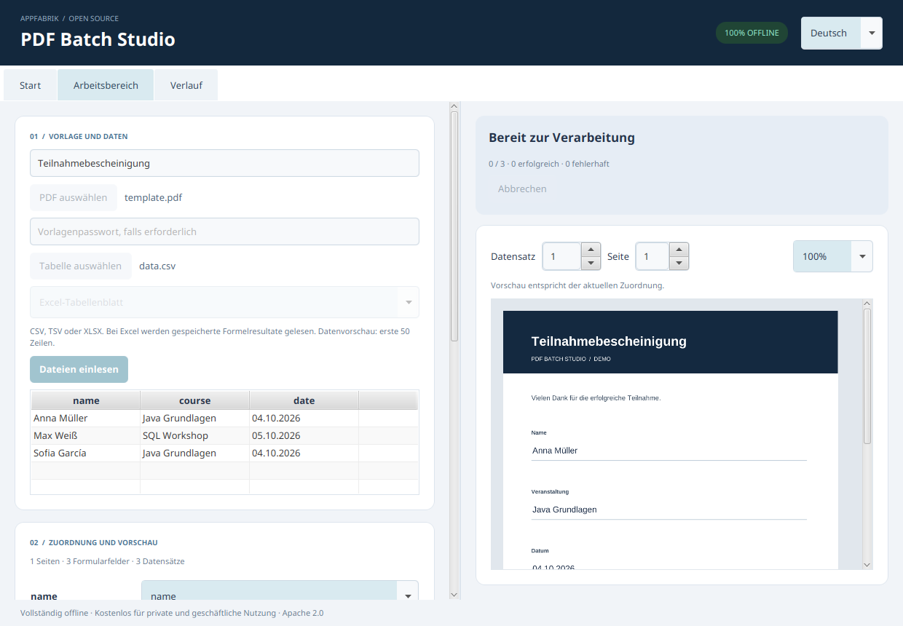
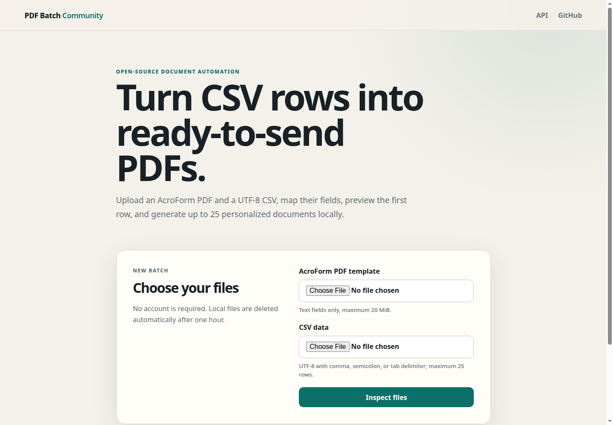
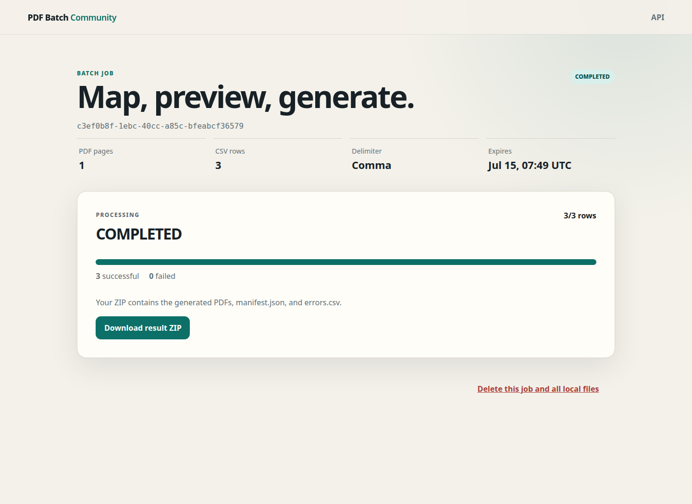

# PDF Batch Studio

PDF Batch Studio creates personalized PDFs from a template and a spreadsheet.
The JavaFX desktop application works completely offline on Windows, macOS and
Linux. It is free for personal and business use under Apache License 2.0.

## Desktop 1.0

- two built-in examples with generated, non-sensitive documents
- saved projects, reusable mappings and portable `.pdfbatch` project archives
- CSV, TSV and XLSX import with worksheet selection and a 50-row data preview
- AcroForm text fields, checkboxes, dropdowns and radio buttons
- suggested column mappings that users review before processing
- preflight with record-specific errors, record/page preview and zoom
- background processing, progress, cancellation and partial success
- collision-safe filenames, ZIP or new-folder export, manifest and error report
- password-protected templates with appropriate permissions and optional AES-256 output encryption
- local SQLite project storage and processing history, including interrupted runs
- German and English interface, file drag-and-drop and keyboard controls
- no account, network connection or separately installed Java runtime required

Open an example on the start screen, review the suggested mappings and preview,
then select **Generate PDFs** and a new output location. For repeated work, save
a named project and select a new table on the next run.

Input templates must be standard AcroForms. Plain PDFs without fields, XFA,
signed templates, OCR and creating new form fields are outside this version.
Checkbox data accepts `true/false`, `yes/no`, `ja/nein` or `1/0`. Choice fields
accept the template's option values. Font/length problems are reported during
preflight. XLSX uses cached formula results, not formula evaluation. Recalculate
and save spreadsheets before importing them when their formulas have changed.

The self-hosted Spring Boot server continues to support the established CSV
and text-field workflow through `/api/v1`. Desktop-only options do not change
the server API. The shared Java processing engine remains framework-free at
its application boundary.

## Release downloads

One version produces separate, clearly named downloads from the same source:

| Use | Release artifact |
| --- | --- |
| Windows desktop | `pdf-batch-studio-desktop-<version>-windows-x64.exe` |
| Apple Silicon desktop | `pdf-batch-studio-desktop-<version>-macos-arm64.dmg` |
| Intel macOS desktop | `pdf-batch-studio-desktop-<version>-macos-x64.dmg` |
| Linux desktop | `pdf-batch-studio-desktop-<version>-linux-x64.tar.gz` |
| Debian / Ubuntu desktop | `pdf-batch-studio-desktop-<version>-linux-x64.deb` |
| Standalone server | `pdf-batch-studio-server-<version>.jar` |
| Docker server | `pdf-batch-studio-server-<version>-docker.zip` |

Tagged releases also publish a versioned GHCR image, SHA-256 checksums, and a
CycloneDX SBOM. Use the local start commands below to try the current source tree.

## Quick start: local web application

Requirements:

- a full JDK 21 installation (`javac` must be available)
- Bash-compatible shell on Linux/macOS, or Maven Wrapper on Windows

Run:

```bash
./scripts/dev.sh
```

Open <http://localhost:8080/>. The local profile uses an embedded file-based H2
database and stores disposable job data below
`server/pdf-batch-server/.local-data/`. It is intended only for local testing.

Try the checked-in files:

- PDF: `samples/customer-template.pdf`
- CSV: `samples/customers.csv`
- map `fullName` to `name`
- map `customerNumber` to `customerId`
- use `{customerId}-{name}.pdf` as the filename pattern

## Quick start: offline desktop application

Run the JavaFX application on Linux or macOS:

```bash
./scripts/desktop-dev.sh
```

On Windows PowerShell:

```powershell
.\scripts\desktop-dev.ps1
```

The desktop application uses JavaFX, PDFBox, Commons CSV and Apache POI.
SQLite and Flyway store projects and history locally, without Spring or a
separate database server. Windows uses `%LOCALAPPDATA%/PDFBatchStudio`, macOS
uses `~/Library/Application Support/PDFBatchStudio`, and Linux uses
`$XDG_DATA_HOME/pdf-batch-studio` or `~/.local/share/pdf-batch-studio`.

Saved projects retain the original template and configuration. Recipient tables
and intermediate output are kept only in the managed session workspace and
removed after use or at the next startup. Passwords are never persisted. The
database and stored templates are not encrypted by the application.

Portable project files contain a versioned properties manifest and original
PDF template. They do not contain recipient tables, results or passwords.



### Native packages

Create and smoke-test a local application image with:

```bash
./scripts/package-desktop.sh app-image
```

On Windows use `scripts/package-desktop.ps1`. Create the Linux archive and,
when `fakeroot` is installed, the Debian package with
`./scripts/package-desktop.sh linux`. The unified `Release packages` workflow
creates all target-specific downloads. The first release packages are
intentionally unsigned, so Windows SmartScreen or macOS Gatekeeper may show a
warning.

### Server release bundle

Build the executable JAR, Docker Compose bundle, and SBOM locally with:

```bash
./scripts/package-server.sh
./scripts/smoke-server.sh target/release/pdf-batch-studio-server-*.jar
```

Generated release files stay below ignored `target/` directories. See
[`docs/releases.md`](docs/releases.md) for the release contract.

## PostgreSQL with Docker Compose

```bash
cp .env.example .env
docker compose up --build
```

The web application is available at <http://localhost:8080/> and PostgreSQL is
bound to `127.0.0.1:54329`. Stop it with:

```bash
docker compose down
```





Use `docker compose down -v` only when you intentionally want to delete the
local database and job volumes.

## Verification

```bash
./scripts/test-all.sh
```

The build runs unit, PDF/CSV, security-boundary, application smoke, and real
HTTP workflow tests. The PostgreSQL/Testcontainers test runs when Docker is
available and is skipped with an explicit reason otherwise.

Useful individual commands:

```bash
./mvnw verify
./mvnw -pl core/pdf-batch-document -am test
./mvnw -pl server/pdf-batch-server -am test
./mvnw -pl desktop/pdf-batch-desktop -am test
./scripts/generate-sample.sh
```

On this machine, set `JAVA_HOME` to a full JDK if the system `java` command is
only a JRE. The scripts automatically use `$HOME/.local/jdk-21` when present.

## API and health

While the application is running:

- OpenAPI JSON: <http://localhost:8080/v3/api-docs>
- Swagger UI: <http://localhost:8080/swagger-ui.html>
- health: <http://localhost:8080/actuator/health>
- readiness: <http://localhost:8080/actuator/health/readiness>

The API is versioned below `/api/v1`. Its upload lifecycle is documented in
[`docs/api/upload-lifecycle.md`](docs/api/upload-lifecycle.md).

## Repository layout

```text
pdf-batch-studio/
├── core/
│   ├── pdf-batch-core/          domain, use cases, and ports
│   └── pdf-batch-document/      PDFBox, CSV, ZIP, and local files
├── server/
│   ├── pdf-batch-persistence/   JPA, PostgreSQL, and Flyway
│   └── pdf-batch-server/        Spring Boot, REST, Thymeleaf, and HTMX
├── desktop/
│   └── pdf-batch-desktop/       JavaFX offline application and adapters
├── docs/                        ADRs, API notes, and portfolio case study
├── infrastructure/              production-shaped container image
├── samples/                     safe PDF and CSV files
├── scripts/                     local development and verification helpers
└── compose.yml
```

This directory is one independent Git repository. Server, desktop, and shared
core are intentionally released together. See
[`PRODUCT_STRUCTURE.md`](PRODUCT_STRUCTURE.md).

## Known limitations

- Desktop supports text, checkbox, choice and radio AcroForms. The server
  currently supports text fields only. Neither delivery supports signing,
  image overlays or creating fields in flat PDFs.
- Resource limits remain configurable safeguards. Desktop processing uses one
  local worker and server processing defaults to two workers and a bounded queue.
- Polling is used instead of server-sent events.
- Anonymous access assumes a trusted local/self-hosted environment. Random job
  UUIDs act as unguessable handles, not as user authentication.
- The local H2 profile is a convenience environment, not the future hosted
  production database.
- Desktop installers are not yet code-signed, notarized, or auto-updating.

## License

Copyright (c) 2026 Wasiliy Strecker.

Original project code and documentation are licensed under [Apache License 2.0](LICENSE).
Personal and commercial use, modification and redistribution are permitted
under its terms. Third-party components retain their own licenses, listed in
[THIRD_PARTY_NOTICES.md](THIRD_PARTY_NOTICES.md).
