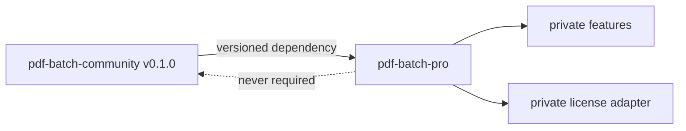

# Community and PRO repository split

## Decision

Community and PRO are separate top-level Git repositories. They should be
siblings inside the developer workspace, not branches and not copied source
trees:

```text
~/dev/app_factory/
├── pdf-batch-community/   public GitHub repository (this repository)
└── pdf-batch-pro/         future private GitLab repository
```

`app_factory` itself is currently not a Git repository, so these boundaries do
not create nested-repository ambiguity.

## Source ownership

This repository is the single source of truth for all shared functionality. It
must always build and run without PRO access. Private code must never be copied
back into Community or hidden behind an unavailable private dependency.

The future PRO repository should pin an exact released Community version. The
preferred steady-state boundary is versioned Maven artifacts for public Java
modules. A temporary Git submodule is acceptable only for the first private
integration milestone, pinned to a tag or commit and never edited as a fork.



## Allowed public extension points

Community may define generic policies and ports that are useful on their own,
such as quotas, storage, job dispatch, or entitlements. It must not contain
production license verification, secret keys, checkout code, paid limits, or
private implementations.

## Deferred PRO scope

No PRO source or repository is created in this milestone. Later paid scope may
include higher limits, saved templates/mappings, filename presets, history,
concurrent jobs, longer retention, and the existing AppFabrik annual-license
adapter. Live hosting and checkout integration are explicitly deferred.

## Release update flow

1. Fix shared behavior in Community.
2. Run Community quality gates and tag a release.
3. Publish or expose that exact version.
4. Update the pinned version in PRO.
5. Run PRO integration and license-boundary tests.

Free/PRO branches and duplicated `backend/` trees are prohibited because they
inevitably drift and can leak private code.
