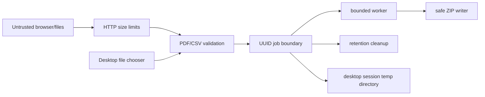

# Security policy and threat model

## Reporting a vulnerability

Do not open a public issue for a vulnerability involving a reproducible exploit
or sensitive data. Contact the repository owner privately and include the
affected version, impact, and minimal reproduction. Never attach real customer
documents.

## Trust boundaries

The PDF, CSV, multipart metadata, API JSON, desktop-selected paths, and original
filenames are untrusted. The database, configured storage root, application
binary, and operator-provided environment variables are trusted administrative
inputs.

## Implemented controls

- fixed upload and request-size limits plus independent stream limits
- generated UUID directories and fixed internal filenames
- normalized storage paths and no use of original filenames as filesystem paths
- server rejection of encrypted input, desktop password/permission checks
- rejection of XFA and signed templates in the desktop workflow
- AcroForm page, field, field-value, and CSV row limits
- strict UTF-8 decoding and delimiter/header/row validation
- streaming CSV processing and one-PDF-at-a-time output
- sanitized filenames, case-insensitive collision handling, and safe ZIP paths
- configurable bounded executor, queue, and active-job capacity
- deterministic resource closing and idempotent result/job deletion
- one-hour default retention with scheduled cleanup
- no document values or uploaded content in application logs
- CSP, `X-Content-Type-Options`, and Spring Security defaults
- generic processing failures in persisted public status
- placeholder-only `.env.example`
- desktop operation without HTTP, telemetry or accounts
- local JDBC transactions, foreign keys, versioned migrations and an application lock
- managed desktop workspace and staged export without overwriting existing files
- desktop cleanup after export, cancellation, failure, and normal shutdown

## Residual risks and deployment assumptions

- The Studio server is anonymous. UUIDs are high-entropy access handles, but
  they are not identity or authorization. Deploy it on a trusted network until
  authentication and ownership are added.
- PDFBox parses complex untrusted input. Keep dependencies patched, constrain
  memory/CPU at the container boundary, and do not expose this MVP as an
  unlimited public upload service.
- Local files are not encrypted by the application. Use encrypted disks and
  appropriate host permissions where documents are sensitive.
- A server crash can leave an in-progress job until cleanup. Server startup
  reconciliation is a roadmap item.
- A crash can leave files in the desktop workspace. The next exclusive startup
  clears this workspace and marks incomplete history as interrupted. It does
  not resume processing automatically.
- SQLite, saved templates and project names are ordinary local files. Output
  password protection does not encrypt the application database or history.
- Project archives accept exactly two bounded entries with fixed names. XLSX
  uses POI ZIP/XML protections, row/cell limits and bounded normalized output.
- Passwords are held in memory only. JVM memory is not a secure password vault.
- Malware scanning, sandboxed document workers, rate limiting, and audit logs
  are outside the current local MVP.

## Secrets

No secrets are required by the Studio code. Never commit `.env`, database
passwords, private keys, production endpoints, signing credentials, or customer
documents. Public source licensing is enforced through legal terms, not a
bundled secret or phone-home mechanism.

## Supported versions

The current development line receives security fixes. Tagged artifacts must be
rebuilt to include dependency or runtime security updates.
