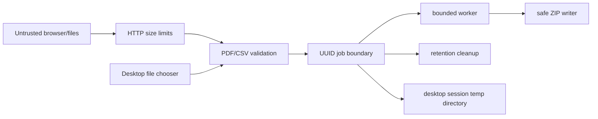

# Security policy and threat model

## Reporting a vulnerability

Do not open a public issue for a vulnerability involving a reproducible exploit
or sensitive data. Contact the repository owner privately and include the
affected version, impact, and minimal reproduction. Never attach real customer
documents.

## Trust boundaries

The PDF, CSV, multipart metadata, API JSON, desktop-selected paths, and original
filenames are untrusted. The database, configured storage root, application
binary, and operator-provided environment variables are trusted administrative
inputs.

## Implemented controls

- fixed upload and request-size limits plus independent stream limits
- generated UUID directories and fixed internal filenames
- normalized storage paths and no use of original filenames as filesystem paths
- rejection of invalid, encrypted, or password-protected PDFs
- AcroForm page, field, field-value, and CSV row limits
- strict UTF-8 decoding and delimiter/header/row validation
- streaming CSV processing and one-PDF-at-a-time output
- sanitized filenames, case-insensitive collision handling, and safe ZIP paths
- bounded executor and one active job per process
- deterministic resource closing and idempotent result/job deletion
- one-hour default retention with scheduled cleanup
- no document values or uploaded content in application logs
- CSP, `X-Content-Type-Options`, and Spring Security defaults
- generic processing failures in persisted public status
- placeholder-only `.env.example`
- desktop operation without HTTP, telemetry, accounts, or persistent database
- per-launch desktop temporary root and atomic result export where supported
- desktop cleanup after export, cancellation, failure, and normal shutdown

## Residual risks and deployment assumptions

- The Community MVP is anonymous. UUIDs are high-entropy access handles, but
  they are not identity or authorization. Deploy it on a trusted network until
  authentication and ownership are added.
- PDFBox parses complex untrusted input. Keep dependencies patched, constrain
  memory/CPU at the container boundary, and do not expose this MVP as an
  unlimited public upload service.
- Local files are not encrypted by the application. Use encrypted disks and
  appropriate host permissions where documents are sensitive.
- A crash can leave an in-progress job until cleanup. Startup reconciliation is
  a roadmap item.
- An operating-system or power crash can leave a desktop session directory in
  the system temporary area. It contains only the files selected for that local
  job and is never uploaded by the application.
- Malware scanning, sandboxed document workers, rate limiting, and audit logs
  are outside the current local MVP.

## Secrets

No secrets are required by the Community code. Never commit `.env`, database
passwords, private keys, entitlement signing keys, production endpoints, or
customer documents. The future PRO license adapter belongs only in a private
repository.

## Supported versions

Until the first tagged release, only the latest `main` commit receives security
fixes. This section should be updated when release branches exist.
